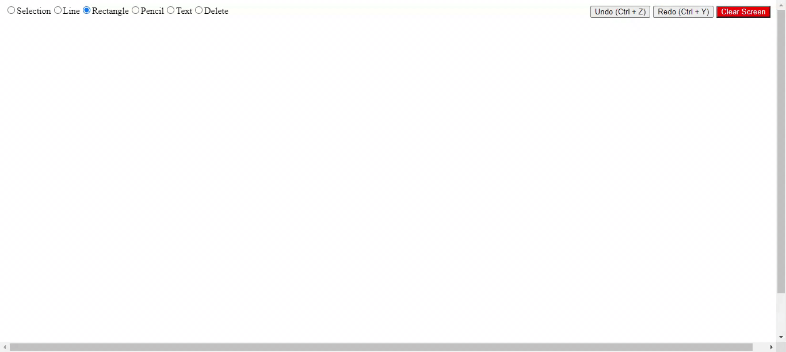

<p align="center">
  <a href="" rel="noopener">
 
</p>
<h1 align = 'center'>LetsDraw</h1>

<br>

&emsp;&emsp;&emsp;&emsp;&emsp;&emsp;&emsp;&emsp;&emsp;&emsp;&emsp;&emsp;&emsp;&emsp;&emsp;[](https://reactjs.org/docs/getting-started.html)&emsp;[](https://code.visualstudio.com/ "Visual Studio Code")


<h2> About </h2>
<p>
In this project, basic functionalities of a simple online whiteboard tool are implemented. In my opinion, this project has by far been the best project to learn javascript.
</p>

-----------------------------------

### Demo

<p align="center">

</p>


-----------------------------------


### 🚀 Features

<p align="left">
   <ul>
      <li>Draw, drag, resize Rectangle</li>
      <li>Draw, drag, resize Line</li>
      <li>Draw, drag Free hand pencil drawing</li>
      <li>Maintain drawing history with undo-redo feature</li>
   </ul>
</p>


-----------------------------------

### :guide_dog: Installation Guide

A step by step series of examples that tell you how to get a development env running

In your cmd:

```
git clone https://github.com/RugvedB/LetsDraw/
```

Then,

```
cd LetsDraw
npm install
npm start
```

You are done with the setup now!


### :page_with_curl: Acknowledgements & References

- Redhwan Nacef - https://www.youtube.com/c/RedhwanNacef
- Javascript - https://developer.mozilla.org/en-US/docs/Web/JavaScript

-----------------------------------

<h3 align="center"><b>Developed with :heart: <a href="https://github.com/RugvedB">Rugved</a> </b></h1>
